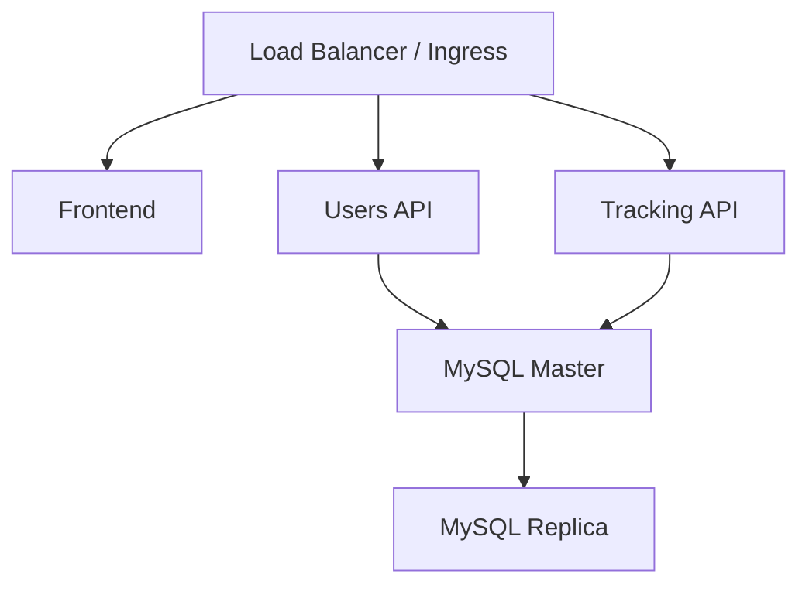

# SpotMe-Infra-K8s

> Infraestructura moderna para desplegar SpotMe en Kubernetes y Azure AKS

---

## 🏋️ ¿Qué es este repositorio?

SpotMe-Infra-K8s contiene toda la infraestructura, manifiestos y scripts necesarios para desplegar SpotMe, una plataforma de gestión de gimnasio basada en microservicios, sobre Kubernetes. Permite despliegue local, en la nube (AKS), y automatización CI/CD.

---

## 🚀 Características principales

- **Despliegue Dinámico:** Cambia automáticamente entre recursos locales y de nube.
- **Sistema de Templates:** Manifiestos generados automáticamente desde templates base.
- **Integración con Azure Container Registry (ACR):** Soporte nativo para producción.
- **Scripts de ayuda:** Automatización para desarrollo, testing y despliegue.
- **Seguridad:** Certificados TLS, secretos y network policies.
- **Alta disponibilidad:** Replicación MySQL y réplicas de APIs/frontend.
- **Monitoreo:** Health checks, métricas y logging centralizado.

---

## 🧩 Arquitectura



---

## 📦 Componentes principales

- **Frontend:** React
- **Users API:** Laravel
- **Tracking API:** Laravel
- **MySQL Master/Replica:** Bases de datos con TLS y replicación
- **Ingress/Load Balancer:** NGINX con TLS
- **ConfigMaps y Secrets:** Configuración y credenciales seguras
- **HAProxy:** Balanceo para MySQL

---

## 📑 Documentación

- [Guía de Despliegue Dinámico](docs/DEPLOYMENT-GUIDE.md)
- [Sistema de Templates](docs/TEMPLATE-SYSTEM.md)
- [Guía de Instalación](INSTALLATION-GUIDE.md)
- [Guía Completa de Referencia](README-COMPLETE.md)
- [Configuración Técnica](TECHNICAL-CONFIG.md)
- [Guía de Testing](TESTING-GUIDE.md)
- [Configuración de Puertos](PORTS-CONFIGURATION.md)
- [Preguntas Frecuentes](FAQ.md)
- [Guía del Metrics Server](METRICS-SERVER-GUIDE.md)
- [Changelog](CHANGELOG.md)

---

## ⚡ Despliegue rápido

### Local (recomendado)
```bash
cd SpotMe-Infra-K8s/scripts
./spotme-local-setup-k8s.sh
kubectl get pods -n spotme
kubectl port-forward svc/frontend-service 3000:3000 -n spotme
```


### Producción (AKS)
```powershell
# Aplicar namespace y configuración
kubectl apply -f .\kubernetes\01-namespace.yaml
kubectl apply -f .\kubernetes\config\

# Aplicar los certificados SSL de Cloudflare a Kubernetes
kubectl create secret tls cloudflare-ssl --cert=.\kubernetes\config\09-loadbalancer\origin.pem --key=.\kubernetes\config\09-loadbalancer\origin.key -n spotme

# Aplicar todos los manifiestos y despliegues
kubectl apply -f .\kubernetes\
```

### Azure Kubernetes Service (AKS)
```bash
cd SpotMe-Infra-K8s
./scripts/aks-quick-setup.sh
./scripts/aks-quick-setup.sh --with-acr
```

---

## 🛠️ Desarrollo iterativo

```bash
./spotme-dev-helper.sh users-api    # Solo Users API
./spotme-dev-helper.sh frontend     # Solo Frontend
./spotme-dev-helper.sh all          # Todos los componentes
./spotme-dev-helper.sh status       # Ver estado del despliegue
```

---

## ✅ Verificación del despliegue

```bash
kubectl get pods -n spotme
kubectl get svc -n spotme
kubectl get ingress -n spotme
```

---

## 🔒 Requisitos previos

- Docker Desktop
- kubectl
- Kubernetes cluster (minikube, kind, AKS, etc.)
- Bash (Linux/macOS) o PowerShell (Windows)

---

## 🌐 Acceso a los servicios

- **Frontend:** https://localhost:50500
- **Users API:** https://localhost:50350
- **Tracking API:** https://localhost:50351

---

## 📁 Estructura del proyecto

```text
SpotMe-Infra-K8s/
├── kubernetes/                  # Manifiestos y configs principales
│   ├── 01-namespace.yaml
│   ├── 04-mysql-master-updated.yaml
│   ├── 05-mysql-replica-updated.yaml
│   ├── 06-users-api-updated.yaml
│   ├── 07-tracking-api-updated.yaml
│   ├── 08-frontend-updated.yaml
│   ├── 09-loadbalancer-production.yaml
│   ├── config/                  # ConfigMaps, Secrets y certificados
│   └── HAProxy/                 # Configuración de balanceo MySQL
├── scripts/                     # Scripts de despliegue y utilidades
├── infra/                       # Infraestructura adicional
├── README.md                    # Este archivo
└── ...                          # Otros docs y guías
```

---

## 🤝 Soporte y contribuciones

¿Tienes dudas, sugerencias o quieres contribuir? Consulta [TECHNICAL-CONFIG.md](TECHNICAL-CONFIG.md) y abre un issue o pull request.

---

## 📄 Licencia

MIT
