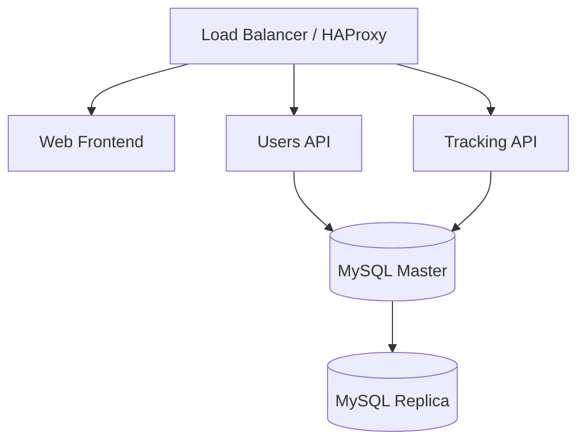

# SpotMe — Kubernetes Infrastructure

Manifests, configuration, and automation to deploy the entire SpotMe platform on Kubernetes — locally or on **Azure AKS**.

## What's inside

```
kubernetes/
├── 01-namespace.yaml                # spotme namespace
├── 04-mysql-master-updated.yaml     # MySQL master (SSL, secrets-injected credentials)
├── 05-mysql-replica-updated.yaml    # MySQL replica (SSL replication)
├── 06-users-api-updated.yaml        # Users API deployment
├── 07-tracking-api-updated.yaml     # Tracking API deployment
├── 08-frontend-updated.yaml         # Web client deployment
├── 09-loadbalancer-production.yaml  # Production load balancer
├── rbac-guest-access.yaml           # Read-only guest RBAC
├── config/                          # ConfigMaps & Secret templates (values as CHANGE_ME)
└── HAProxy/                         # Load balancer configuration
```

## Highlights

- **High availability** — MySQL master/replica topology with SSL-encrypted replication, health checks, and resource quotas.
- **Security** — credentials injected via Kubernetes Secrets (templates committed with `CHANGE_ME` placeholders only), TLS termination, and RBAC-scoped guest access.
- **Cloud-ready** — tested on Azure AKS with Azure Container Registry; see `DEPLOYMENT-GUIDE.md` for the step-by-step rollout.
- **Load balancing** — HAProxy in front of the APIs and frontend.

## Architecture



Part of the [SpotMe monorepo](https://github.com/Jorge706/SpotMe) — see the root README for the full architecture.
